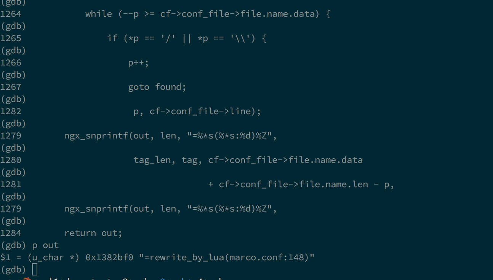
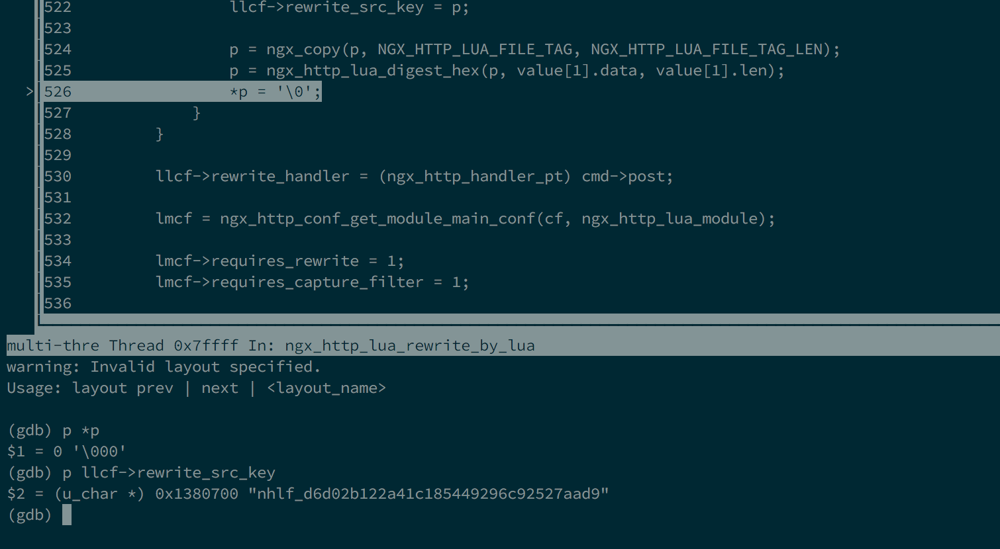

> 以下代码均出自 lua-nginx-module v0.10.7 版本
>
> 这篇文章主要要介绍 `rewrite_by_lua` 这个指令以及由这个指令延伸开来的相关函数。 <br>
> rewrite 是 Nginx HTTP 框架划分的 11 个阶段的其中之一，通常在这个阶段我们可以实现 uri 的修改；下面的讲解以 `rewrite_by_lua` 这个指令来展开，`rewrite_by_lua_block` 和 `rewrite_by_lua _file` 类似，不展开讨论。
> 


### rewrite_by_lua

`lua-nginx-module` 通过这个指令来介入到一个请求的 rewrite 阶段。先来看下其配置项结构。

```c
     { ngx_string("rewrite_by_lua"),
     NGX_HTTP_MAIN_CONF|NGX_HTTP_SRV_CONF|NGX_HTTP_LOC_CONF|NGX_HTTP_LIF_CONF|NGX_CONF_TAKE1,
     ngx_http_lua_rewrite_by_lua,
     NGX_HTTP_LOC_CONF_OFFSET,
     0,
     (void *) ngx_http_lua_rewrite_handler_inline },
```

从这里可以了解到：

- 这个指令可以出现在 main 配置块下、server 配置块下、location 配置块下和 location 下的 if 块。
- 必须携带一个参数。
- 解析函数是 `ngx_http_lua_rewrite_by_lua`。

同样地，我们来看下 `ngx_http_lua_rewrite_by_lua ` 这个函数：

```c
/* parse `rewrite_by_lua` */
char *
ngx_http_lua_rewrite_by_lua(ngx_conf_t *cf, ngx_command_t *cmd, void *conf)
{
    u_char                      *p, *chunkname;
    ngx_str_t                   *value;
    ngx_http_lua_main_conf_t    *lmcf;
    ngx_http_lua_loc_conf_t     *llcf = conf;

    ngx_http_compile_complex_value_t         ccv;

    dd("enter");

#if defined(nginx_version) && nginx_version >= 8042 && nginx_version <= 8053
    return "does not work with " NGINX_VER;
#endif

    /*  must specify a content handler */
    if (cmd->post == NULL) {
        return NGX_CONF_ERROR;
    }

    if (llcf->rewrite_handler) {
        return "is duplicate";
    }

    value = cf->args->elts;

    if (value[1].len == 0) {
        /*  Oops...Invalid location conf */
        ngx_conf_log_error(NGX_LOG_ERR, cf, 0,
                           "invalid location config: no runnable Lua code");

        return NGX_CONF_ERROR;
    }
    
    if (cmd->post == ngx_http_lua_rewrite_handler_inline) {
        chunkname = ngx_http_lua_gen_chunk_name(cf, "rewrite_by_lua",
                                                sizeof("rewrite_by_lua") - 1);
        if (chunkname == NULL) {
            return NGX_CONF_ERROR;
        }

        llcf->rewrite_chunkname = chunkname;

        /* Don't eval nginx variables for inline lua code */

        llcf->rewrite_src.value = value[1];

        p = ngx_palloc(cf->pool, NGX_HTTP_LUA_INLINE_KEY_LEN + 1);
        if (p == NULL) {
            return NGX_CONF_ERROR;
        }

        llcf->rewrite_src_key = p;

        p = ngx_copy(p, NGX_HTTP_LUA_INLINE_TAG, NGX_HTTP_LUA_INLINE_TAG_LEN);
        p = ngx_http_lua_digest_hex(p, value[1].data, value[1].len);
        *p = '\0';
    } else {
        ngx_memzero(&ccv, sizeof(ngx_http_compile_complex_value_t));
        ccv.cf = cf;
        ccv.value = &value[1];
        ccv.complex_value = &llcf->rewrite_src;

        if (ngx_http_compile_complex_value(&ccv) != NGX_OK) {
            return NGX_CONF_ERROR;
        }

        if (llcf->rewrite_src.lengths == NULL) {
            /* no variable found */
            p = ngx_palloc(cf->pool, NGX_HTTP_LUA_FILE_KEY_LEN + 1);
            if (p == NULL) {
                return NGX_CONF_ERROR;
            }

            llcf->rewrite_src_key = p;

            p = ngx_copy(p, NGX_HTTP_LUA_FILE_TAG, NGX_HTTP_LUA_FILE_TAG_LEN);
            p = ngx_http_lua_digest_hex(p, value[1].data, value[1].len);
            *p = '\0';
        }
    }

    llcf->rewrite_handler = (ngx_http_handler_pt) cmd->post;

    lmcf = ngx_http_conf_get_module_main_conf(cf, ngx_http_lua_module);

    lmcf->requires_rewrite = 1;
    lmcf->requires_capture_filter = 1;

    return NGX_CONF_OK;
}
```

首先这个函数计算了个叫做 `chunkname` 的字符串，可以看到它是在函数 `ngx_http_lua_gen_chunk_name` 里得到的，通过 gdb 调试，我们可以看到，最终得到的 `chunkname` 是 `"rewrite_by_lua(marco.conf:148)"`，这个字符串的作用后面会介绍。



接下来根据配置项配置的 post 指针指向的函数不同，记录下 Lua code 或者 Lua code path；最后为 Lua code cache 这个功能计算了一个 cache key，通过 gdb 我们来看下计算出来的 key 是什么样的（这边实例走的是 `rewrite_by_lua_file` 指令）。



后面就是用这个 key 来检索缓存 Lua code，当然前提是 `lua_code_cache` 这条指令打开，生产环境中一般都需要对 Lua code 进行缓存以提高效率；开发环境中为了调试方便则可以关闭缓存。

恩，指令解析到这里就结束了，那么，`rewrite_by_lua` 究竟是如何让 Lua code 介入到 HTTP 请求里的呢？下面就来一探究竟。

### rewrite_by_lua_handler

这是真正被插入到 rewrite 阶段的回调方法（见 [ngx_lua_init_by_lua](001-ngx_lua_init_by_lua.md) 关于`ngx_http_lua_init` 的介绍）。

```c
ngx_int_t
ngx_http_lua_rewrite_handler(ngx_http_request_t *r)
{
    ngx_http_lua_loc_conf_t     *llcf;
    ngx_http_lua_ctx_t          *ctx;
    ngx_int_t                    rc;
    ngx_http_lua_main_conf_t    *lmcf;

    /* XXX we need to take into account ngx_rewrite's location dump */
    if (r->uri_changed) {
        /* to next http module */
        return NGX_DECLINED;
    }

    ngx_log_debug2(NGX_LOG_DEBUG_HTTP, r->connection->log, 0,
                   "lua rewrite handler, uri:\"%V\" c:%ud", &r->uri,
                   r->main->count);

    lmcf = ngx_http_get_module_main_conf(r, ngx_http_lua_module);

    /*
     * this if block will put the rewrite_by_lua to
     * the last position of nginx rewirte phase
     */
    if (!lmcf->postponed_to_rewrite_phase_end) {
        ngx_http_core_main_conf_t       *cmcf;
        ngx_http_phase_handler_t        tmp;
        ngx_http_phase_handler_t        *ph;
        ngx_http_phase_handler_t        *cur_ph;
        ngx_http_phase_handler_t        *last_ph;

        lmcf->postponed_to_rewrite_phase_end = 1;

        cmcf = ngx_http_get_module_main_conf(r, ngx_http_core_module);

        ph = cmcf->phase_engine.handlers;
        cur_ph = &ph[r->phase_handler];
        /* the last module in rewrite phase */
        last_ph = &ph[cur_ph->next - 1];

#if 0
        if (cur_ph == last_ph) {
            dd("XXX our handler is already the last rewrite phase handler");
        }
#endif

        if (cur_ph < last_ph) {
            dd("swaping the contents of cur_ph and last_ph...");

            tmp      = *cur_ph;

            memmove(cur_ph, cur_ph + 1,
                    (last_ph - cur_ph) * sizeof (ngx_http_phase_handler_t));

            *last_ph = tmp;

            r->phase_handler--; /* redo the current ph */

            return NGX_DECLINED;
        }
    }

	 llcf = ngx_http_get_module_loc_conf(r, ngx_http_lua_module);

    if (llcf->rewrite_handler == NULL) {
        dd("no rewrite handler found");
        return NGX_DECLINED;
    }

    ctx = ngx_http_get_module_ctx(r, ngx_http_lua_module);

    dd("ctx = %p", ctx);

    if (ctx == NULL) {
        ctx = ngx_http_lua_create_ctx(r);
        if (ctx == NULL) {
            return NGX_HTTP_INTERNAL_SERVER_ERROR;
        }
    }

    dd("entered? %d", (int) ctx->entered_rewrite_phase);

    /* rewrite_by_lua can't be finished in one epoll dispatch */
    if (ctx->entered_rewrite_phase) {
        dd("rewriteby: calling wev handler");
        rc = ctx->resume_handler(r);
        dd("rewriteby: wev handler returns %d", (int) rc);

        if (rc == NGX_OK) {
            rc = NGX_DECLINED;
        }

        if (rc == NGX_DECLINED) {
            if (r->header_sent) {
                dd("header already sent");

                /* response header was already generated in access_by_lua*,
                 * so it is no longer safe to proceed to later phases
                 * which may generate responses again */

                if (!ctx->eof) {
                    dd("eof not yet sent");

                    rc = ngx_http_lua_send_chain_link(r, ctx, NULL
                                                     /* indicate last_buf */);
                    if (rc == NGX_ERROR || rc > NGX_OK) {
                        return rc;
                    }

                    return NGX_OK;
                }
            }

            return rc;
        }

        if (ctx->waiting_more_body) {
            /* waiting for more request body */
            return NGX_DONE;
        }

    /* lua_need_request_body directive */
    if (llcf->force_read_body && !ctx->read_body_done) {
        r->request_body_in_single_buf = 1;
        r->request_body_in_persistent_file = 1;
        r->request_body_in_clean_file = 1;

        rc = ngx_http_read_client_request_body(r,
                                       ngx_http_lua_generic_phase_post_read);

        if (rc == NGX_ERROR || rc >= NGX_HTTP_SPECIAL_RESPONSE) {
#if (nginx_version < 1002006) ||                                             \
        (nginx_version >= 1003000 && nginx_version < 1003009)
            r->main->count--;
#endif

            return rc;
        }

        if (rc == NGX_AGAIN) {
            ctx->waiting_more_body = 1;
            return NGX_DONE;
        }
    }

    dd("calling rewrite handler");
    return llcf->rewrite_handler(r);
}
```

让我们来解剖下这个函数。<br>
首先可以看到，如果 uri 被改变了，该函数直接返回。 <br>
再来回顾下 [ngx_lua_init_by_lua](001-ngx_lua_init_by_lua.md) 这一节，里面有介绍 `ngx_http_lua_init` 这个函数，该函数的一小段代码则是把 `lmcf->postponed_to_rewrite_phase_end ` 置 0，这个变量用来标记 `rewrite_by_lua` 的回调方法是否被放置 rewrite 阶段最后，因此这个函数需要检测下这个变量，当它发现 Lua 的回调方法没有放到最后一位时（第一个被 Lua 介入到的请求），需要手动修改回调方法的位置，我们知道 HTTP 框架通过 `phase_engine.handlers` 这个动态数组来连续存放每个 HTTP 模块插入到所有阶段的回调，因此修改顺序实际只需要修改这个数组就行了，值得注意的是，我们要对 `r->phase_handler` 减一，因为交换顺序完毕后，该函数返回 `NGX_DECLINED`，代表希望 HTTP 框架按顺序执行下一个模块的回调，而在 `ngx_http_core_rewrite_phase` 这个 checker 中则会对 `r->phase_handler` 加一，为了某个模块的回调不被漏掉，这里才对这个值减去了 1。

继续看这个函数，我们会发现原来 `lua-nginx-module` 的模块上下文也是在某请求里被创建的，当然只会创建一次；另外，对于重入到 `rewrite_by_lua` 的情况，这个函数也做了处理；最后，当它发现需要需要读取请求体的时候，它还会调用 `ngx_http_read_client_request_body ` 来读请求体，如果一次读不完，把 `ctx->waiting_more_body` 设置为 1，然后返回 `NGX_DONE`，这个特殊的返回值会让 `ngx_http_core_rewrite_phase ` 这个 checker 会让 HTTP 框架的控制权返回到事件模块，调度其他的请求，而这个请求则会在未来某个时刻被重新调度到，届时 `rewrite_by_lua ` 的回调方法会被重入，当然，该读的读完，一切就绪之后，就轮到我们的 Lua 代码被执行了，也就是 `ngx_http_lua_rewrite_handler_inline ` 会被调用。

### ngx_http_lua_rewrite_handler_inline

```c
ngx_int_t
ngx_http_lua_rewrite_handler_inline(ngx_http_request_t *r)
{
    lua_State                   *L;
    ngx_int_t                    rc;
    ngx_http_lua_loc_conf_t     *llcf;

    dd("rewrite by lua inline");

    llcf = ngx_http_get_module_loc_conf(r, ngx_http_lua_module);
    L = ngx_http_lua_get_lua_vm(r, NULL);

    /*  load Lua inline script (w/ cache) sp = 1 */
    rc = ngx_http_lua_cache_loadbuffer(r->connection->log, L,
                                       llcf->rewrite_src.value.data,
                                       llcf->rewrite_src.value.len,
                                       llcf->rewrite_src_key,
                                       (const char *)
                                       llcf->rewrite_chunkname);
    if (rc != NGX_OK) {
        return NGX_HTTP_INTERNAL_SERVER_ERROR;
    }

    return ngx_http_lua_rewrite_by_chunk(L, r);
}
```

这个函数通过函数 `ngx_http_lua_get_lua_vm` 获取到 Lua VM，然后进行 rewrite 阶段的 Lua code 的“载入”（从缓存里取或者调用 `lua_loadbuffer` 载入）
最后调用 `ngx_http_lua_rewrite_by_chunk ` 运行 Lua chunk。下面就来分析下这些过程。

### ngx_http_lua_get_lua_vm

首先，Lua VM 是怎么取到的呢？请看 `ngx_http_lua_get_lua_vm`：

```c
static ngx_inline lua_State *
ngx_http_lua_get_lua_vm(ngx_http_request_t *r, ngx_http_lua_ctx_t *ctx)
{
    ngx_http_lua_main_conf_t    *lmcf;

    if (ctx == NULL) {
        ctx = ngx_http_get_module_ctx(r, ngx_http_lua_module);
    }

    if (ctx && ctx->vm_state) {
        return ctx->vm_state->vm;
    }

    lmcf = ngx_http_get_module_main_conf(r, ngx_http_lua_module);
    dd("lmcf->lua: %p", lmcf->lua);
    return lmcf->lua;
}
```

代码非常简单，首先是尝试从 `lua-nginx-module` 模块上下文里取 Lua VM，但是有可能此时 ctx 还没有被创建出来，所以在 ctx 没有被创建出来的情况下，就从 `lua-nginx-module` 的 main 配置结构体里取出 Lua VM。

### ngx_http_lua_cache_loadbuffer

接下来我们看下 得到 Lua chunk 的过程，也就是 `ngx_http_lua_cache_loadbuffer`
这个函数：

```c
ngx_int_t
ngx_http_lua_cache_loadbuffer(ngx_log_t *log, lua_State *L,
    const u_char *src, size_t src_len, const u_char *cache_key,
    const char *name)
{
    int          n;
    ngx_int_t    rc;
    const char  *err = NULL;

    n = lua_gettop(L);

    dd("XXX cache key: [%s]", cache_key);

    rc = ngx_http_lua_cache_load_code(log, L, (char *) cache_key);
    if (rc == NGX_OK) {
        /*  code chunk loaded from cache, sp++ */
        dd("Code cache hit! cache key='%s', stack top=%d, script='%.*s'",
           cache_key, lua_gettop(L), (int) src_len, src);
        return NGX_OK;
    }

    if (rc == NGX_ERROR) {
        return NGX_ERROR;
    }

    /* rc == NGX_DECLINED */

    dd("Code cache missed! cache key='%s', stack top=%d, script='%.*s'",
       cache_key, lua_gettop(L), (int) src_len, src);

    /* load closure factory of inline script to the top of lua stack, sp++ */
    rc = ngx_http_lua_clfactory_loadbuffer(L, (char *) src, src_len, name);

    if (rc != 0) {
        /*  Oops! error occurred when loading Lua script */
        if (rc == LUA_ERRMEM) {
            err = "memory allocation error";

        } else {
            if (lua_isstring(L, -1)) {
                err = lua_tostring(L, -1);
                
            } else {
                err = "unknown error";
            }
        }

        goto error;
    }

    /*  store closure factory and gen new closure at the top of lua stack to
     *  code cache */
    rc = ngx_http_lua_cache_store_code(L, (char *) cache_key);
    if (rc != NGX_OK) {
        err = "fail to generate new closure from the closure factory";
        goto error;
    }

    return NGX_OK;

error:

    ngx_log_error(NGX_LOG_ERR, log, 0,
                  "failed to load inlined Lua code: %s", err);
    lua_settop(L, n);
    return NGX_ERROR;
}
```

还记得之前所说的 `chunkname` 和 `rewrite_src_key`？没错，那两个字符串的用武之地就是在这里！我们来分析下这个函数，这里有个缓存状态机，步骤如下：

1. 调用 `ngx_http_lua_cache_load_code`，判断当前的 Lua chunk 有没有缓存，得到返回码，如果返回码为 NGX_OK，跳到第二步；如果返回码是 `NGX_ERROR`，跳到第三步；否则跳到第四步。
2. 从缓存中拿到 Lua chunk 且被压入到栈，返回 NGX_OK。
3. 出错，返回 NGX_ERROR。
4. 缓存 Miss，从原生的 Lua 代码加载，然后压栈，如果出错，记录错误日志然后返回。`NGX_ERROR`；否则返回 `NGX_OK`。

这里对 `ngx_http_lua_cache_load_code `，`ngx_http_lua_clfactory_loadbuffer ` 和 `ngx_http_lua_cache_store_code ` 这三个具体的函数不展开分析，详细讨论见 [ngx_http_lua_cache](012-ngx_lua_cache.md)。

最后 Lua chunk 已经被拿到而且已经在栈顶，之后就是调用`ngx_http_lua_rewrite_by_chunk` 运行通过指令传入的 Lua 代码了。

### ngx_http_lua_rewrite_by_chunk

```c
static ngx_int_t
ngx_http_lua_rewrite_by_chunk(lua_State *L, ngx_http_request_t *r)
{
    int                      co_ref;
    lua_State               *co;
    ngx_int_t                rc;
    ngx_event_t             *rev;
    ngx_connection_t        *c;
    ngx_http_lua_ctx_t      *ctx;
    ngx_http_cleanup_t      *cln;

    ngx_http_lua_loc_conf_t     *llcf;

    /*  {{{ new coroutine to handle request */
    co = ngx_http_lua_new_thread(r, L, &co_ref);

    if (co == NULL) {
        ngx_log_error(NGX_LOG_ERR, r->connection->log, 0,
                      "lua: failed to create new coroutine to handle request");

        return NGX_HTTP_INTERNAL_SERVER_ERROR;
    }

    /*  move code closure to new coroutine */
    lua_xmove(L, co, 1);

    /*  set closure's env table to new coroutine's globals table */
    ngx_http_lua_get_globals_table(co);
    lua_setfenv(co, -2);

    /*  save nginx request in coroutine globals table */
    ngx_http_lua_set_req(co, r);

    /*  {{{ initialize request context */
    ctx = ngx_http_get_module_ctx(r, ngx_http_lua_module);

    dd("ctx = %p", ctx);

    if (ctx == NULL) {
        return NGX_ERROR;
    }

    ngx_http_lua_reset_ctx(r, L, ctx);

    ctx->entered_rewrite_phase = 1;
	
	 ctx->cur_co_ctx = &ctx->entry_co_ctx;                                                                                                                                                                                      
    ctx->cur_co_ctx->co = co;
    ctx->cur_co_ctx->co_ref = co_ref;
#ifdef NGX_LUA_USE_ASSERT
    ctx->cur_co_ctx->co_top = 1;
#endif

    /*  }}} */

    /*  {{{ register request cleanup hooks */
    if (ctx->cleanup == NULL) {
        cln = ngx_http_cleanup_add(r, 0);
        if (cln == NULL) {
            return NGX_HTTP_INTERNAL_SERVER_ERROR;
        }

        cln->handler = ngx_http_lua_request_cleanup_handler;
        cln->data = ctx;
        ctx->cleanup = &cln->handler;
    }
    /*  }}} */

    ctx->context = NGX_HTTP_LUA_CONTEXT_REWRITE;

    llcf = ngx_http_get_module_loc_conf(r, ngx_http_lua_module);

    if (llcf->check_client_abort) {
        r->read_event_handler = ngx_http_lua_rd_check_broken_connection;

#if (NGX_HTTP_V2)
        if (!r->stream) {
#endif

        rev = r->connection->read;

        if (!rev->active) {
            if (ngx_add_event(rev, NGX_READ_EVENT, 0) != NGX_OK) {
                return NGX_ERROR;
            }
        }

#if (NGX_HTTP_V2)
        }
#endif

    } else {
        r->read_event_handler = ngx_http_block_reading;
    }

    rc = ngx_http_lua_run_thread(L, r, ctx, 0);

    if (rc == NGX_ERROR || rc > NGX_OK) {
        return rc;
    }

    c = r->connection;

    if (rc == NGX_AGAIN) {
        rc = ngx_http_lua_run_posted_threads(c, L, r, ctx);

    } else if (rc == NGX_DONE) {
        ngx_http_lua_finalize_request(r, NGX_DONE);
        rc = ngx_http_lua_run_posted_threads(c, L, r, ctx);
    }

    if (rc == NGX_OK || rc == NGX_DECLINED) {
        if (r->header_sent) {
            dd("header already sent");

            /* response header was already generated in access_by_lua*,
             * so it is no longer safe to proceed to later phases
             * which may generate responses again */

            if (!ctx->eof) {
                dd("eof not yet sent");

                rc = ngx_http_lua_send_chain_link(r, ctx, NULL
                                                  /* indicate last_buf */);
                if (rc == NGX_ERROR || rc > NGX_OK) {
                    return rc;
                }
            }

            return NGX_HTTP_OK;
        }

        return NGX_DECLINED;
    }

    return rc;
}
```


> 附录：ngx_http_lua_rewrite_by_chunk 函数 Lua 栈变化图

```c
/* the new coroutine

|----------|
|stack peak|
|----------|
|Lua chunk |
|----------|
	||
	||	ngx_http_lua_get_globals_table
	\/
|----------------|
|   stack peak   |
|----------------|
|   Lua chunk    |
|----------------|
|Lua global table|
|----------------|
	||
	|| lua_setfenv, ngx_http_lua_set_req
	\/
|----------|
|stack peak|
|----------|
|Lua chunk |
|----------|	
	||
	||
	\/
	
*/
```

### 总结

本节通过 `rewrite_by_lua` 这个指令介绍了 `lua-nginx-module` 是怎么样介入请求，如何加载、缓存 Lua 代码
